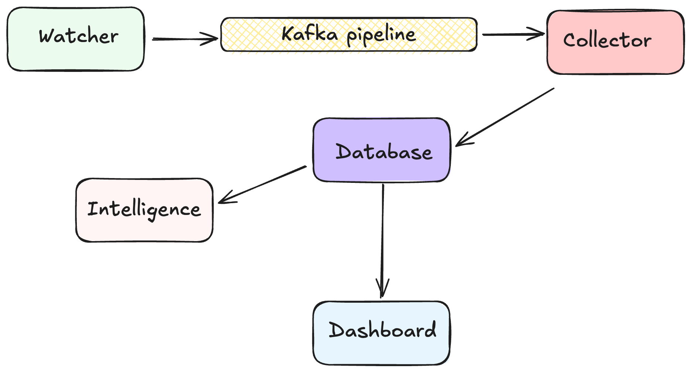
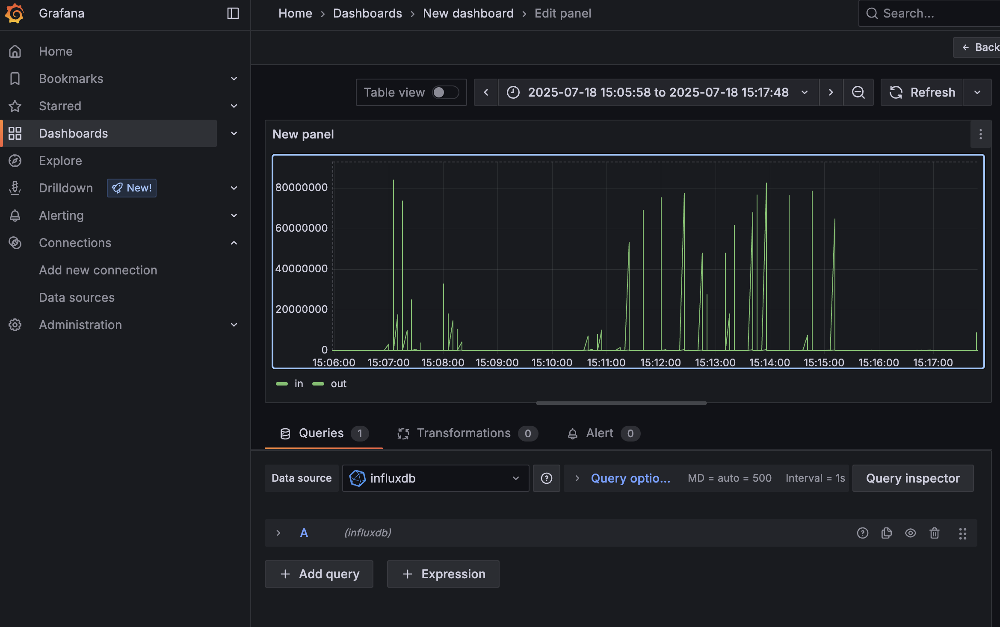
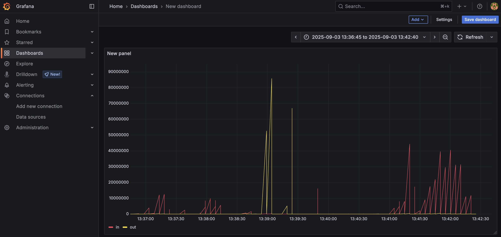
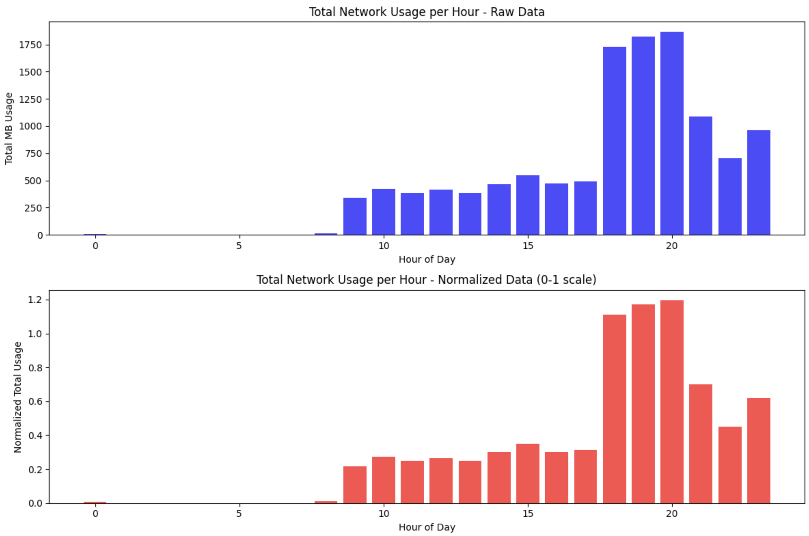

# Network Behavior Intelligence

It is a real-time system that watches per-application network activity and transforms it into a time-series dataset for analysis. Instead of just logging raw traffic, it builds an evolving baseline of your daily usage patterns and applies Machine Learning (Autoencoders with sliding windows) to detect anomalies. It can adopt your daily routine and learn behavior shifts.


## Architecture and design



### Watcher

Wraps the macOS utility nettop to track network usage per application. Runs every 1-minute intervals and publishes parsed results to Kafka. Produces raw JSON logs that contain inbound/outbound bytes for each active app.

### Collector

Consumes data from Kafka. Buffers records in memory and writes them to InfluxDB in batches for efficiency. Ensures data continuity even if ingestion is temporarily delayed.

### Intelligence module flow

- Fetch the data from database using a query which aggregates N days data into hours
- Create a matrix 24 hours x 5 apps for N days.
- These N days are prior to current day. If its 2:23PM on July 11 and N days will be from 10 July - Nth day prior that. We will not include today's day because that is our detection day as anomalous or normal.
- Then we scale this data by dividing it with max value because its a time series data and we need to preserve the distribution which is not necessarily binomial or normal distribution.
- We create an autoencoder 120-60-30-10-30-60-120
- Train the autoencoder using our N days matrix
- Then we define a threshold by calculating reconstruction error of N day matrix to our trained autoencoder and take the max error value.
- Then we create matrix of current day and scale.
- Pass it to autoencoder and compare the error with threshold to detect anomaly.

### Why Autoencoder?

Autoencoders tolerate small amounts of noise and generalize better than one-class SVM, z-score, or isolation forest. For example, using Chrome instead of Safari at a given hour should not be flagged, but a consistent large deviation in usage will trigger an anomaly.

We don’t need to go into LSTM either. LSTM is used to predict next hour which we are not doing so stfu. Although clustering would also work here. Right now we are only doing workdays with Autoencoder but Clustering can also handle weekends and off days as well. But let’s stick with Autoencoder as of now and will add clustering later.

### Dashboard

To visualize the collected network data, the system integrates with Grafana, which connects directly to the InfluxDB time-series database. The dashboard provides real-time insights into application-level traffic, showing both inbound (in) and outbound (out) network usage.

The first screenshot highlights a short time window where spikes of traffic are captured every few seconds. Each vertical line corresponds to bytes flowing in or out of an application during a given interval:



The second screenshot shows a longer observation period, with more pronounced bursts of traffic. Red lines track incoming traffic, while yellow lines represent outgoing traffic. This makes it easy to spot sudden surges, quiet periods, and unusual patterns that may later be flagged by the anomaly detection pipeline.



### Kafka Pipeline

My watcher was putting data into python's thread safe queue and then my collector was taking the data out of the queue. Queue was initialized in main file which is shared among both watcher and collector. Consider this, my queue seems to be in shared memory accessible to both watcher and collector. This is kind making both of them tightly coupled right? I can't put them on separate servers as microservice.
Solution: Apply Kafka Queue to decouple them.

### Docker

I am using InfluxDB for my time series dataset, Kafka as queue and Grafana for dashboard. All of these are external services which can be placed in a docker container. So I containerized Kafka, InfluxDB, and Grafana in a Docker Compose setup so the environment is reproducible, portable, and easy to spin up with a single command. This way, contributors don’t need to manually install or configure external dependencies, and the development environment stays consistent with how services are typically deployed in production.

Note: Watcher is running `nettop` which is observing your device's network data so it has to be on the machine and can't be isolated in container.

## Understanding Daily Patterns



Network usage naturally reflects human routines. The chart above shows an example of how traffic looks for a typical working professional:

- **Night (0–7 hrs):** Near-zero usage while the person is asleep.
- **Work hours (9–17 hrs):** Steady, moderate usage from tools like Slack, Zoom, email, and code editors. The activity is consistent but not extreme.
- **Evening (18–22 hrs):** A sharp rise in network traffic as the person streams movies, plays online games, or uses other high-bandwidth apps.
- **Late night (after 23 hrs):** Activity tapers off again as the day ends.

By capturing this rhythm as a time series, the system can distinguish between normal variations (like a Zoom meeting mid-day) and unusual events (for example, a huge spike at 3 AM). These behavioral baselines are what the anomaly detection model learns from and compares against each new day. 

Normalization of data should be X_train/max(X_train) to preserve the distribution. Don’t normalize using any mean or anything otherwise everything will get screwed up. Data is skewed towards right. Night and morning are calm and nights are full of chrome heavy streaming.

## Installation & Setup

**Clone the repository**

```shell
git clone https://github.com/Lakshyasaharan5/realtime-behavior-intelligence.git
cd realtime-behavior-intelligence
```

**Start external services**

This will spin up Kafka, InfluxDB, and Grafana (via Docker).

```shell
./scripts/start_external_services.sh
```

**Verify InfluxDB**

Make sure the database is up and running. You might need to create a database and table:

```shell
influxdb3 query -d realtime_network_metrics 'show tables'
```

**Run the Watcher + Collector**

The watcher wraps macOS nettop and streams app-level network usage into Kafka.
The collector consumes from Kafka and stores data into InfluxDB.

```shell
poetry run python src/main.py
```

**Run the Intelligence module**

This pipeline pulls baseline data from InfluxDB, trains an autoencoder, and performs anomaly detection on the latest day.

```shell
poetry run python src/intelligence/pipeline.py
```

**Open the dashboard**

Grafana is available at: `http://localhost:3000/`

You can create a new panel and run queries against InfluxDB to see a live feed of your network usage (in/out traffic per app, aggregated by interval).

## Future Plans

There are some problems and updates which I need to work on.

- In case I don’t record a data for particular time interval then I will use previous days data to fill that spot to keep the flow undisturbed. But I will also flag it as uncollected data.
- I am worried that my pattern and data is not that consistent. For example between 11-12 I open chrome someday and maybe some other day I use safari for browsing then it will flag it as anomaly which is not the case. Suppose I open a youtube link in slack causing its data to spike from 1mb to 20mb suddenly and it will detect it as anomaly which is also not the case. Additionally how can I make my model with just few features like day, time, date, app names, network etc. I need to minimize false positives in anomaly.

Contributions and suggestions are always welcome! ❤️

## License

This project is licensed under the MIT License — see the [LICENSE](./LICENSE) file for details.


